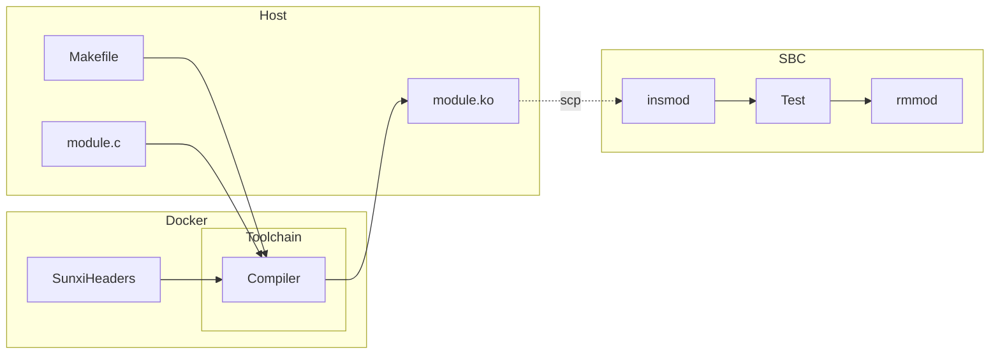
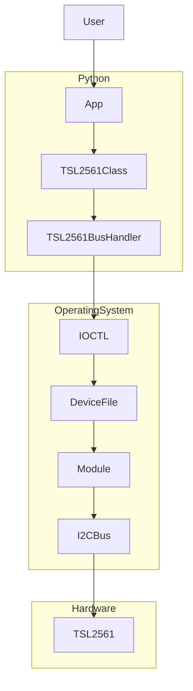

# TSL256X-Linux-Driver
TSL2561 I2C Light Sensor driver implemented as a Kernel Module for ARM64
architecture.

## Overview
This project was build to show how to develop a simple I2C Subsystem Driver
using a concrete example, wish a dash of software engineering spice.


## Hardware
For this project the following hardware has been used
1. **Host**: Ubuntu 20.04 Laptop.
1. **SBC**: Libretech Tritium H3 (Allwinner H5 version), running Armbian.
1. **I2C Sensor**: TSL2561 Light Sensor Adafruit Kit.

Essentially, the connection diagram is as follows:


## Development Environment
To compile and build the module, this project uses Docker. Thus, it comes with a [Dockerfile](./docker/Dockerfile) to easily
build a suitable conntainerized development environment. There are multiple reasons for this:
1. The exact toolchain and Linux headers are downloaded and installed in the
environment when the image is build, leaving no room for 
obtaining the wrong toolchain or downloading incorrect header versions.
1. The host computer doesn't need to natively install headers or crosscompilers
that will (probably) be only useful for the scope of thisproject. It also reduces the 
chances of breaking anything in the host computer.

### Instructions
To get it working, simply run `scripts/docker_build.sh` the first time and 
`scripts/docker_run.sh` each time compilation of the module is needed. The
second command will open up a terminal ready to run `make` and build the module.
If curious about what's that doing, everything related to the environment built
is within the [docker](./docker/) directory.
Note that the module is built `Out of Tree`. Once built, it can be transferred to the SBC through SCP or any other method.

### Workflow Summary
Essentially, the devopment workflow is depicted by the following diagram:




## Embedded Linux
The SBC has been flashed with a cutom `Armbian` image. The configuration of the
Linux Kernel used to build such image can be found [here](./docker/kernel/.config).  
Some other relevant details of the build distribution are listed below:
1. **Kernel**: linux-5.15.74-sunxi64
1. **Armbian**: sunxi64_22.08.6_arm64

### Some Tips on building the Armbian Image
Building armbian is pretty much trivial, but customizing it or trying to learn
the details of the intermediate steps ran to make it happen may not. To shed 
some light on these steps, it's a good idea to set up the `compile.sh` command
(provided by Armbian) to store cache artifacts somewhere accesible.  

### Toolchain
The Linux toolchain used to build the module present in this project must match 
the one used to build the `Armbian` image. It may not be easy to learn which
toolchain was used by `Armbian` to build the image, given that more than one
toolchain is downloaded during the image construction. Following the steps
described [above](#some-tips-on-building-the-armbian-image) should help

### Headers
Ngl, to find the exact headers needed to get this to work, y redirected the 
stdoutput of Armbians's compile.sh command to a text file, and searched through
the logs until I found which headers were used. Is there a better way? Probably,
but that's what worked for me.

## Driver 

### Overview
The driver module has been implemented so that only the bare minimum knowledge
of the TSL2561 chip is held inside the .c source code. The goal here is to
provide a way to read and write the device's registers easily, so that 
whoever uses the device file from "the outside" can deal with modeling the
sensor and its registers as they see fit.

As an example, apart from the driver itself, a small Python library that uses 
the device file and reads some registers has also been developed as part of 
this project. 

### Module Source
The driver is comprised of 4 blocks, that can be seen by inspecting the main [structure](./src/tsl2561_driver.c#L32-L37) defined in the source code:
```c
struct tsl2561_client {
	struct miscdevice *miscdev;
	struct file_operations *file_ops;
	struct i2c_driver *i2c_driver;
	struct i2c_client *i2c_client;
};
```
From we can learn that the driver:
- Is implemented as a miscdevice. 
- Defines a subset (or all) supported file operations.
- Is an I2C device.

The driver itself holds a static instance of `tsl2561` where the aforementioned 
resources are stored.

### Miscdevice
Nothing too fancy here, just the usual boilerplate code required to make our 
char device a proper `miscdevice`. 

### I2C Device
Again, nothing too fancy, mostly boileplate code. The `miscdevice` instance
is created within the `probe` section of the I2C device code, where the client
and driver details are also stored for use in the file operations.

### File Operations
Here's where the fun begins. The file operations define how our device will
be managed and used through its device file. In particular a protocol was
defined to send and receive commands from Python (or any other external tool).


## Application
Merging everything together, the main architecture of this project ends up
being something like this


